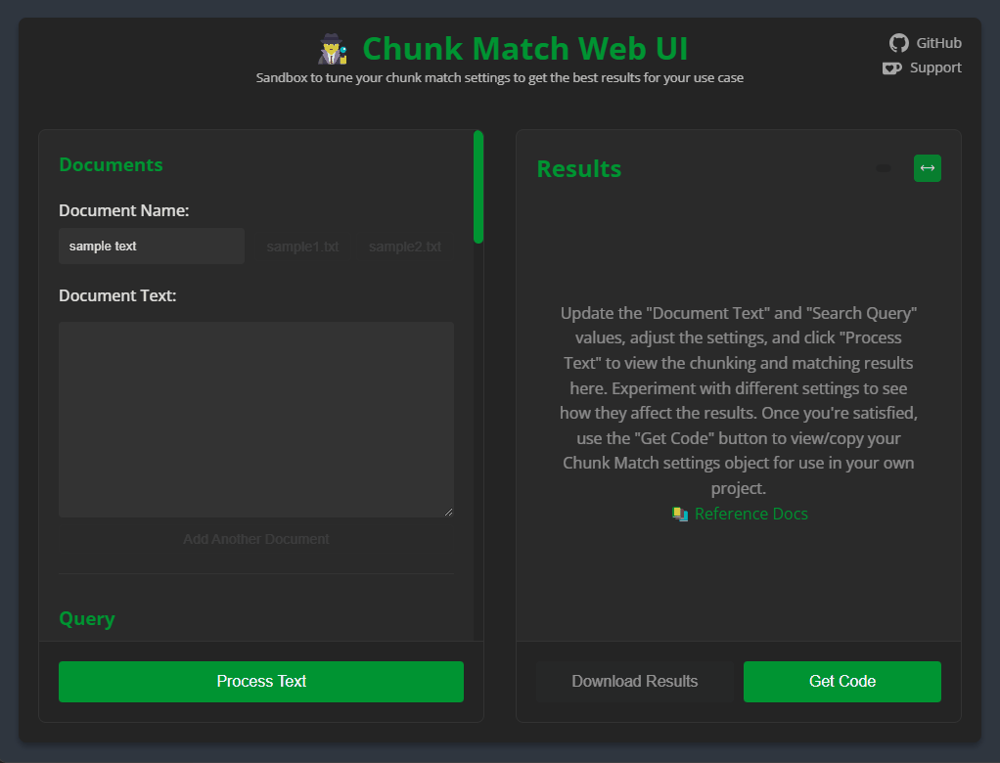

# 🕵️‍♂️ Chunk Match Web UI

A web-based interface for experimenting with and tuning Chunk Match settings. This tool provides a visual way to test and configure the `chunk-match` library's semantic text matching capabilities to get optimal results for your specific use case. Once you've found the best settings, you can generate code to implement them in your project.

## Features

- Real-time semantic text matching with live preview
- Multiple document support
- Query-based semantic search
- Interactive controls for all matching parameters
- Visual feedback for similarity thresholds
- Model selection and configuration
- Results download in JSON format
- Code generation for your settings
- Example texts for testing
- Dark mode interface
- Syntax highlighting of JSON results and code samples
- Line wrapping toggle for JSON results



## Getting Started

### Prerequisites
- Node.js (v18 or higher recommended)
- npm (comes with Node.js)

### Installation

1. Clone the repository: 
```bash
git clone https://github.com/jparkerweb/chunk-match.git
```

2. Navigate to the webui directory:
```bash
cd chunk-match/webui
```

3. Install dependencies:
```bash
npm install
```

4. Start the server:
```bash
npm start
```

5. Open your browser and visit:
```bash
http://localhost:3000
```

## Usage

### Documents

- **Document Name**: Name/identifier for each input document
- **Document Text**: Text content to be chunked and matched
- Add multiple documents using the "Add Another Document" button
- Load example texts using the sample buttons

### Query

- Enter your search query to match against the documents
- Results show semantically similar chunks from your documents

### Match Settings

- **Max Results**: Maximum number of matches to return (1-100)
- **Minimum Similarity**: Minimum similarity threshold for matches (0.1-1.0)

### Chunking Settings

- **Max Token Size**: Maximum size for each chunk (50-2500 tokens)
- **Similarity Threshold**: Base threshold for semantic similarity (0.1-1.0)
- **Similarity Sentences Lookahead**: Number of sentences to look ahead (1-10)

### Dynamic Threshold Settings

- **Lower Bound**: Minimum threshold for dynamic similarity adjustment
- **Upper Bound**: Maximum threshold for dynamic similarity adjustment

### Combine Chunks Settings

- **Combine Chunks**: Enable/disable chunk combination
- **Similarity Threshold**: Threshold for combining similar chunks

### Model Settings

- **Embedding Model**: Choose from various supported embedding models
- **Quantized Model**: Toggle model quantization for better performance
- **Document/Query Prefixes**: Optional prefixes for documents and queries

> Note: The first time you use a model, it will take longer to process as it needs to be downloaded and cached. Subsequent uses will be much faster.

### Results

- View matched chunks in real-time
- See match count, average token length, and processing time
- Download results as JSON
- Get generated code with your current settings

## Development

The web UI is built with:
- `chunk-match` library for semantic text matching
- Express.js for the backend
- Vanilla JavaScript (ES6+) for the frontend
- CSS3 for styling

## License

This project is licensed under the MIT License - see the LICENSE file for details.

## Appreciation

If you enjoy this package please consider sending me a tip to support my work 😀
# [🍵 tip me here](https://ko-fi.com/jparkerweb)
